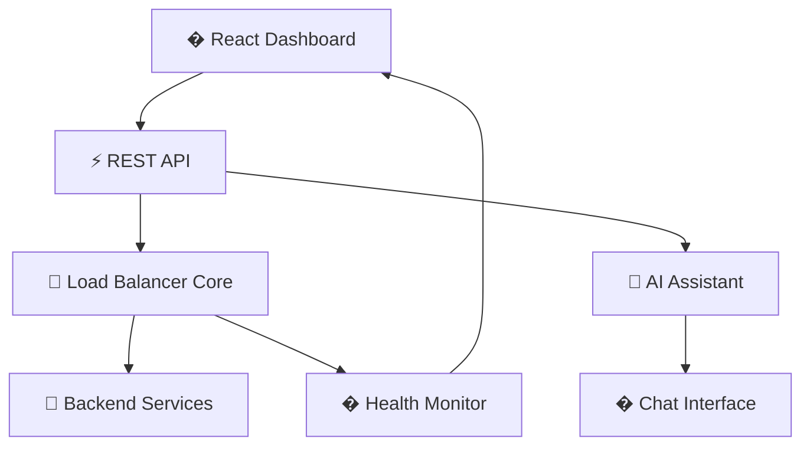
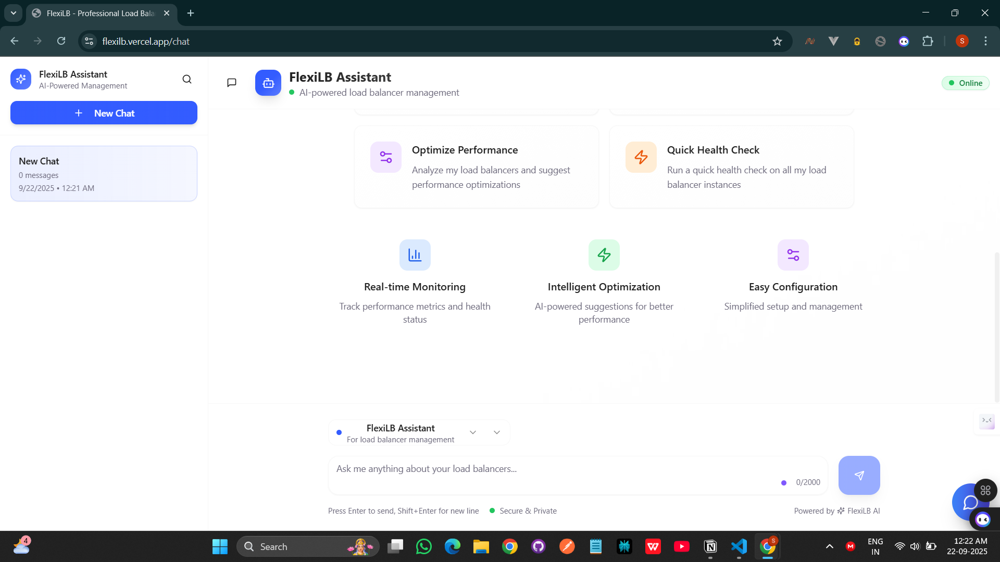
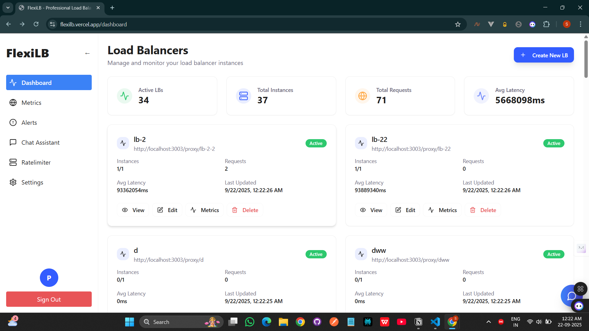
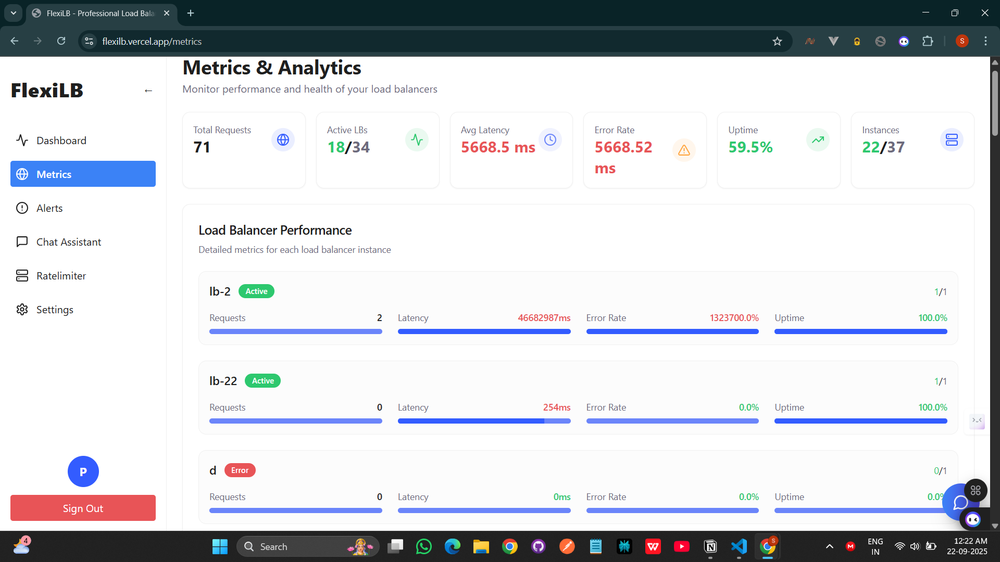

# 🚀 FlexiLB - Smart UI-Based Load Balancer

<div align="center">


[](https://groq.com)
[](https://reactjs.org)
[](LICENSE)

**Visual load balancer management with AI-powered assistance**

[🎯 Live Demo](https://flexilb.vercel.app) | [📖 Documentation](https://docs.flexilb.com) | [🎨 Dashboard](https://flexilb.vercel.app/dashboard)

</div>

---

## � **UI-First Design Philosophy**

> **"Complex infrastructure management made beautifully simple"**

FlexiLB brings **visual simplicity** to load balancer management with an intuitive dashboard that puts powerful controls at your fingertips. No configuration files, no terminal commands - just **clean, modern UI** that makes sense.

### 🖥️ **Visual Management Dashboard**
- **� Real-time Health Monitoring** with live status indicators
- **🎛️ Drag & Drop Configuration** for effortless setup
- **📈 Performance Analytics** with beautiful charts and metrics
- **� Smart Alerts System** with customizable notifications
- **⚙️ One-Click Actions** for common operations

### � **Plus: AI Assistant Integration**
When you need extra help, chat with your infrastructure:
```bash
� "Create api-server with round robin, 3 instances"
✅ Load balancer configured via UI automatically!

� "Show me performance insights for production"  
📊 Dashboard updates with AI-generated recommendations
```

## 🎯 **Core Features**

### 🎨 **Beautiful User Interface**
- **Modern React Dashboard** with responsive design
- **Real-time Status Updates** across all components
- **Interactive Configuration** with form-based setup
- **Visual Health Monitoring** with color-coded indicators
- **Performance Charts** and analytics visualization

### 🤖 **AI-Enhanced Management**
- **Natural Language Chat** for quick operations
- **Smart Recommendations** powered by Groq AI
- **Conversational History** with context awareness
- **Verbose Explanations** for learning and troubleshooting

### 🔧 **Professional Load Balancing**
- **Multiple Algorithms** (Round Robin, Least Connections, Random)
- **Health Check Automation** with configurable intervals
- **Auto-failover** and recovery mechanisms
- **Rate Limiting** and traffic shaping
- **SSL/TLS Termination** support
### 🚀 **Advanced Capabilities**
- **Predictive Health Monitoring** using AI pattern recognition
- **Auto-scaling Recommendations** based on traffic patterns
- **Smart Alert Filtering** to reduce notification noise
- **Performance Optimization** suggestions powered by machine learning

---

## 🏗️ **System Architecture**

<div align="center">



</div>

### 🛠️ **Technology Stack**

| Component | Technology | Purpose |
|-----------|------------|---------|
| 🎨 **Frontend** | React 18 + Vite + TypeScript | Modern responsive UI |
| 🤖 **AI Assistant** | Groq AI + MCP Protocol | Natural language interface |
| ⚡ **Backend** | Bun + Hono + WebSockets | Ultra-fast API & real-time |
| 💾 **Database** | MongoDB + Redis Cache | Persistent data + speed |
| 🔄 **Message Queue** | RabbitMQ (CloudAMQP) | Reliable async processing |
| 🚀 **Deployment** | Vercel + Render | Global edge distribution |

---

## 🎯 **Load Balancing Excellence**

### 🔄 **Intelligent Algorithms**
- **🎪 Round Robin** - Fair traffic distribution
- **⚖️ Least Connections** - Performance-optimized routing  
- **🎲 Random** - Unpredictable load distribution
- **📊 Weighted** - Priority-based routing
- **🧠 AI-Adaptive** - Machine learning optimization (coming soon)

### ❤️ **Health Monitoring & Reliability**
- **Real-time Health Checks** with customizable intervals
- **Visual Status Indicators** in the dashboard
- **Automatic Failover** with intelligent recovery
- **Performance Metrics** tracking and analysis
- **Alert System** with email/webhook notifications

---

## 🚀 **Quick Start Guide**

### 1️⃣ **Installation**
```bash
# 📥 Clone the future
git clone https://github.com/sabarim6369/Flexi-LB.git
cd Flexi-LB

# 🔧 Setup backend
cd Server && bun install
cp .env.example .env  # Configure your secrets

# 🎨 Setup frontend  
cd ../Client && bun install
cp .env.example .env  # Configure your endpoints
```

### 2️⃣ **Environment Configuration**
```env
# 🤖 AI Configuration
GROQ_API_KEY=your_groq_api_key
MCP_ENDPOINT=https://api.modelcontextprotocol.io

# 💾 Database
MONGODB_URI=your_mongodb_connection
REDIS_URL=your_redis_connection

# 🔄 Message Queue
RABBITMQ_URL=your_cloudamqp_url

# 🌐 Deployment
BASE_URL=https://your-domain.com
FRONTEND_URL=https://your-ui-domain.com
```

### 3️⃣ **Launch**
```bash
# 🚀 Start the AI-powered backend
cd Server && bun run dev

# 🎨 Launch the modern frontend
cd Client && bun run dev

# 💬 Start chatting with your infrastructure!
open http://localhost:5173/chat
```

---

## 🎤 **AI Command Examples**

### 📝 **Creating Load Balancers**
```bash
💬 "My load balancer name is web-api, round robin algorithm, 
    URL: http://localhost:3000, instance count: 3"
✅ Created "web-api" with 3 instances using round-robin!

💬 "Create a high-performance load balancer for microservices"
🤖 AI suggests optimal configuration based on your requirements
```

### 📊 **Monitoring & Analytics** 
```bash
💬 "What's the health status of my production services?"
📈 Shows detailed health metrics with AI insights

💬 "Show me performance recommendations for api-gateway"
🎯 AI analyzes patterns and suggests optimizations
```

### 🔧 **Advanced Management**
```bash
💬 "Scale up the payment-service during peak hours"
⚡ AI configures auto-scaling rules intelligently

💬 "Explain why server-3 is slower than others"
🔍 AI investigates and provides detailed analysis
```

---

## 🎨 **Screenshots & Demos**

<div align="center">

### 🤖 **AI Chat Interface**

### 📊 **Real-time Dashboard**  

### ⚡ **Performance Analytics**

</div>

---

## 🏆 **What Makes FlexiLB Special**

| 🌟 Feature | 🔥 Traditional Tools | ⚡ FlexiLB AI |
|------------|---------------------|---------------|
| **Setup Time** | Hours of configuration | Minutes with natural language |
| **Learning Curve** | Steep, requires expertise | Conversational, intuitive |
| **Monitoring** | Static dashboards | AI-powered insights |
| **Troubleshooting** | Manual investigation | AI diagnosis & suggestions |
| **Scaling** | Manual configuration | Intelligent auto-recommendations |

---

## 🤝 **Community & Contributors**

<div align="center">

### 🚀 **Built with ❤️ by innovators**

[](https://github.com/sabarim6369)

**🌟 Join the AI revolution in infrastructure management!**

[](CONTRIBUTING.md)
[](https://discord.gg/flexilb)

</div>

### 🎯 **How to Contribute**
1. 🍴 Fork the repository
2. 🌿 Create your feature branch (`git checkout -b feature/AmazingFeature`)
3. 💻 Make your changes with AI enhancements
4. ✅ Test with the AI assistant
5. 📝 Commit your changes (`git commit -m 'Add AmazingFeature'`)
6. 🚀 Push to the branch (`git push origin feature/AmazingFeature`)
7. 🎉 Open a Pull Request

---

## 📄 **License & Credits**

<div align="center">

**MIT License** - Use it, modify it, love it! ❤️

[](LICENSE)

**Powered by cutting-edge AI technologies:**
- 🧠 [Groq](https://groq.com) for ultra-fast AI inference
- 🔗 [Model Context Protocol](https://modelcontextprotocol.io) for advanced AI integration
- ⚡ [Bun](https://bun.sh) for blazing-fast JavaScript runtime

---

**🚀 Ready to revolutionize your infrastructure management?**

[**🎯 Get Started Now**](https://flexilb.vercel.app) | [**💬 Chat with AI**](https://flexilb.vercel.app/chat) | [**📚 Read Docs**](https://docs.flexilb.com)

</div>


